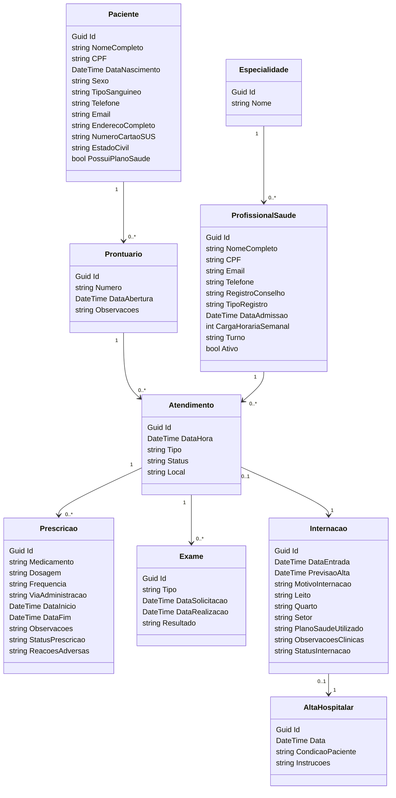

# 🏥 HOSPISIM - Sistema de Gestão Hospitalar

O **HOSPISIM** é um sistema web desenvolvido em ASP.NET Core para modernizar e integrar a gestão clínica hospitalar, com foco em **segurança**, **rastreabilidade** e **controle completo** dos dados dos pacientes, profissionais e atendimentos médicos.

## 🔧 Tecnologias Utilizadas

- ASP.NET Core Web API
- Entity Framework Core
- SQL Server
- Swagger (OpenAPI)
- Scaffold Controllers
- Arquitetura em Camadas (Models, Services, Controllers)

## 📦 Funcionalidades

- Cadastro completo de **pacientes** com validação de CPF
- Registro de **profissionais de saúde** por especialidade
- **Prontuário clínico** vinculado a pacientes
- Gestão de **atendimentos** médicos
- Controle de **prescrições** e **exames**
- Gerenciamento de **internações** e **altas hospitalares**

## 📚 Diagrama de Classes (UML simplificado)



## 🚀 Como executar

1. Clone o projeto:
   ```bash
   git clone https://github.com/seuusuario/hospisim.git
   cd hospisim
   ```

2. Configure a string de conexão no `appsettings.json`:
   ```json
   "ConnectionStrings": {
     "DefaultConnection": "Data Source=PAT622937\\SQLEXPRESS;Initial Catalog=Hospisim;Integrated Security=True;Encrypt=False"
   }
   ```

3. Execute as migrations:
   ```bash
   dotnet ef database update
   ```

4. Inicie a aplicação:
   ```bash
   dotnet run
   ```

5. Acesse o Swagger em:
   ```
   https://localhost:5001/swagger
   ```

## 📌 Autor

**Julio Cesar**  
[(https://github.com/julioarraes42)]# Hospisim
